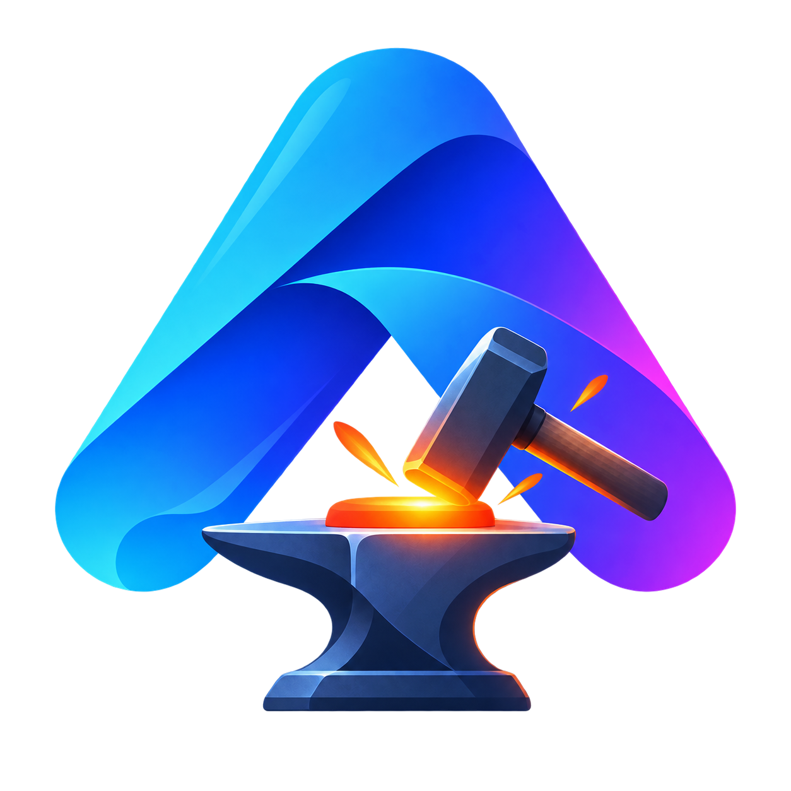
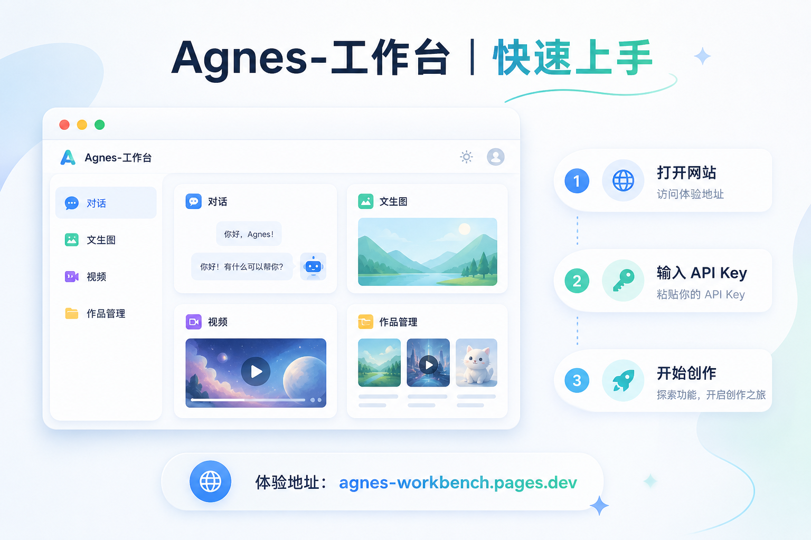
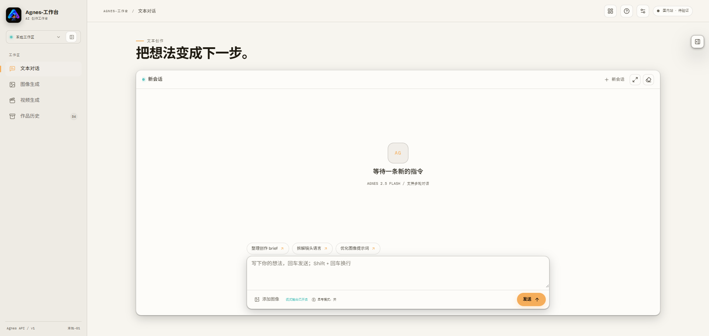
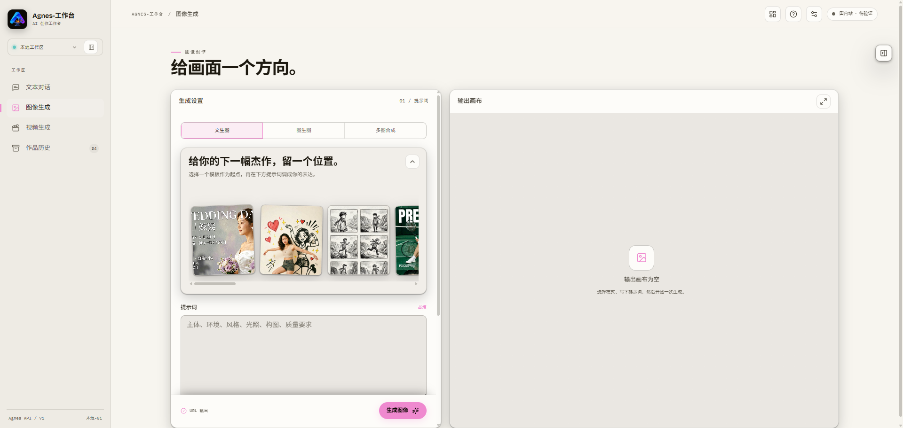
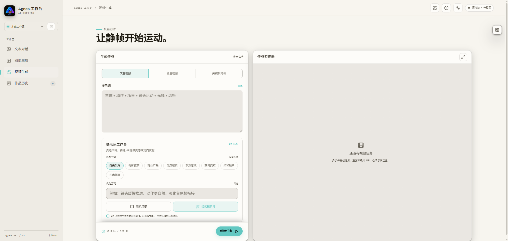
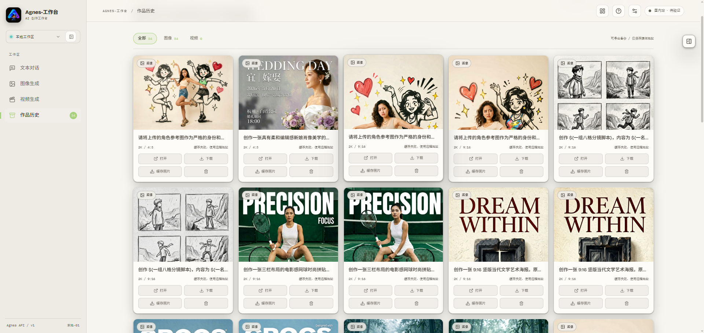
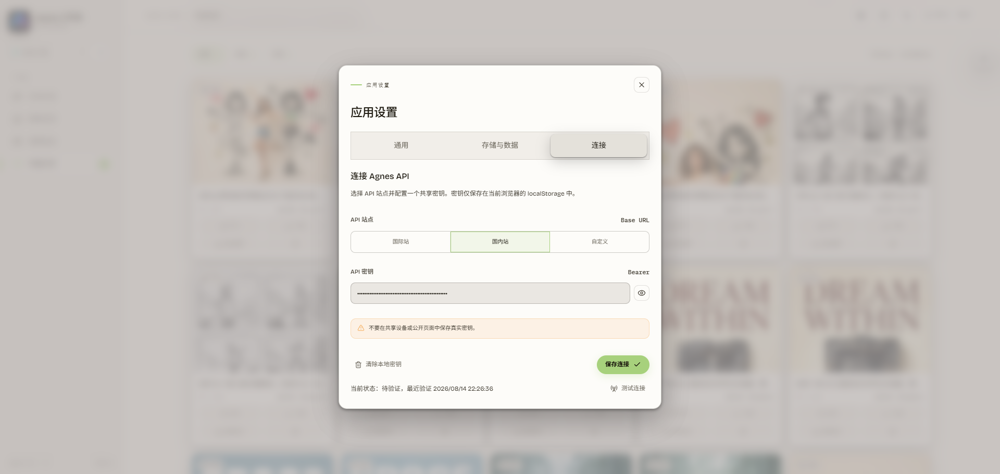

<div align="center">



# Agnes-工作台

**一个浏览器里的多模态 AI 创作工作台 · 无框架 · 无打包器 · 开箱即用**

[](https://github.com/blackteaYES/agnes-workbench)


**[🚀 在线体验](https://agnes-workbench.pages.dev)** · **[📖 项目博客](https://blackteayes.github.io/vibe-coding/agnes-workbench.html)** · **[💬 问题反馈](https://github.com/blackteaYES/agnes-workbench/issues)**

**简体中文** ｜ [English](README.en.md)



</div>

---

## 简介

Agnes-工作台把**文本对话、图像生成、视频生成和作品管理**放进同一个浏览器页面。它基于原生 JavaScript 构建，没有前端框架、没有打包器、没有第三方 CDN 依赖——克隆仓库即得完整可运行的应用，仓库根目录就是发布目录。

它适合希望在一个轻量入口里完成多模态创作、不想在多个工具之间来回切换的你。

## ✨ 功能特性

| 模块 | 能力 |
|---|---|
| 💬 文本对话 | OpenAI 风格流式输出、`reasoning_content` 思考过程、思考模式、多会话、消息编辑与重发、图像理解；对话消息默认按 Markdown 排版渲染（输入框工具栏与设置面板均可开关），Markdown 图片直接展示、可点击预览，加载失败显示占位 |
| 🖼️ 图像生成 | 文生图 / 图生图 / 多图合成，尺寸、比例、风格预设、随机灵感与定向提示词优化 |
| 🎬 视频生成 | 文生视频 / 图生视频 / 关键帧动画，限流退避轮询任务状态，可手动刷新 |
| 🗂️ 作品管理 | 图像 / 视频筛选、删除、下载、本地缓存与重新缓存、备份导入导出 |

围绕创作流程的配套能力：

- **文生图案例**：从外部 JSON 加载案例图片与完整提示词，案例区支持手动折叠、横向滑动与选中态。
- **聊天图片**：文件选择、拖放、HTTPS 链接、作品选择和 SVG 附件统一接入，消息中的图片链接回显为可放大的缩略图。
- **参考图交互**：本地上传、拖放、作品集合与 HTTPS 链接统一入口，可点击预览并直接拖动排序或交换关键帧。
- **统一媒体预览**：图片、视频、作品与参考图共用预览层；桌面使用独立导航，移动端支持滑动切换，详情弹窗展示已保存的生成参数。
- **分层本地存储**：localStorage 只保存轻量状态，完整消息、附件和作品缓存进入 IndexedDB，避免触发容量上限。
- **本地数据管理**：可搜索、查看和安全管理会话、消息、聊天附件、作品缓存与只读系统元数据。
- **统一设置中心**：主题、界面密度、动效、自动保存、保留数量、持久存储、存储健康检查与 Agnes 连接集中管理。

## 📸 使用界面

### 文本对话与图像理解



### 图像生成



### 视频生成



### 作品历史与备份



## 🚀 快速开始

三步开启创作：

### 1. 打开工作台

**在线体验**（推荐）：直接访问 <https://agnes-workbench.pages.dev>。

**本地运行**：项目没有前端依赖，也没有构建步骤，用任意静态服务托管仓库根目录即可：

```powershell
uv run --no-cache python -m http.server 4173 --bind 127.0.0.1
```

然后打开 <http://127.0.0.1:4173/index.html>。

Chrome / Edge 也可以直接双击根目录的 `index.html`：此时案例配置自动切换为本地镜像，官方 Agnes 端点可以直连。不同浏览器对 `file://` 下 localStorage、IndexedDB 和自定义端点 CORS 的策略不同，HTTP(S) 仍是推荐运行方式。

### 2. 连接 Agnes API

打开右上角设置中心的「连接」分区：

1. 选择国际站、国内站或自定义 Base URL；
2. 填入共享 Agnes API Key；
3. 测试连接。



API Key 只保存在本机 localStorage 的 `agnes-workbench.api-key`，通过 `Authorization: Bearer <key>` 发送，不进入作品、备份、IndexedDB 或日志。

### 3. 开始创作

在文本对话、图像生成、视频生成、作品历史四种模式间自由切换。生成结果自动进入作品集合，可缓存、下载和备份。

## 🌐 静态部署

Cloudflare Pages 可直接发布仓库根目录：

```text
构建命令：留空
输出目录：.
入口文件：index.html
```

所有运行资源均使用相对路径，Lucide 图标和字体已随项目本地提供，不依赖第三方脚本或字体 CDN。GitHub Pages 及任意静态 HTTP(S) 服务同样适用。

国际站和国内站 API 支持浏览器跨域请求；自定义 API 需自行配置允许页面来源的 CORS。

## 🔌 连接端点与模型

| 端点 | Base URL |
|---|---|
| 国际站（默认） | `https://apihub.agnes-ai.com` |
| 国内站 | `https://apihub.agnes-ai.cn` |
| 自定义 | 任意合法 HTTPS 地址；本地调试允许 localhost、127.0.0.1 和 `[::1]` 的 HTTP |

| 能力 | 模型 |
|---|---|
| 对话 | `agnes-2.5-flash` |
| 图像 | `agnes-image-2.1-flash` |
| 视频 | `agnes-video-v2.0` |

## 🖼️ 文生图案例配置

案例配置位于 [config/prompt-examples.json](config/prompt-examples.json)，只影响文生图模式，支持一个或多个案例。图生图和多图合成不读取该 JSON，继续使用应用内置的提示词结构示例。

```json
{
  "version": 1,
  "textToImage": {
    "title": "给你的下一幅杰作，留一个位置。",
    "description": "选择一个模板作为起点，再在下方提示词调成你的表达。",
    "examples": [
      {
        "id": "wedding-invitation",
        "title": "中式婚礼请柬",
        "image": "assets/prompt-examples/img/chinese-wedding-invitation.jpg",
        "alt": "柔光新娘肖像与中式婚礼请柬海报",
        "prompt": "完整提示词，可保留 ${变量占位符}"
      }
    ]
  }
}
```

配置规则：

- 文件使用 UTF-8 编码和合法 JSON，不支持注释或尾随逗号。
- `id` 必须唯一且稳定，不能依赖数组下标；`title`、`image`、`alt`、`prompt` 均使用字符串。
- 本地图片放在 `assets/prompt-examples/img/`，填写相对仓库根目录的路径，也可以使用公开 HTTPS 图片地址。
- `${...}` 占位符会原样写入提示词框，不会被应用自动替换。
- 点击案例会填入完整提示词、突出当前案例并平滑滚动案例轨道；不会自动折叠，折叠状态完全由用户控制。
- 图片加载失败时显示占位，但不影响提示词填入。

HTTP(S) 环境直接读取该 JSON；双击 `index.html` 或 JSON 请求失败时，应用回退到 [config/prompt-examples.generated.js](config/prompt-examples.generated.js)。JSON 是唯一人工编辑源，生成文件不要手动修改。修改 JSON 后运行同步脚本，并提交更新后的生成文件：

```powershell
node scripts/sync-prompt-examples.mjs
node scripts/sync-prompt-examples.mjs --check
```

同步脚本会校验结构、案例 ID、图片 URL 形式和本地图片路径，并检测生成文件是否过期。

## 💾 本地存储

### localStorage

- `agnes-workbench.api-key`：API Key。
- `agnes-workbench.v1`：轻量应用状态，包括界面设置、连接端点、会话索引和作品记录。

完整消息正文、思考过程和媒体二进制不会反复写入 localStorage。

### IndexedDB

数据库：`agnes-workbench.storage`，当前版本 `2`。

| 对象仓库 | 内容 | 管理能力 |
|---|---|---|
| `sessions` | 会话标题、时间和消息计数 | 查看、搜索、新建、改标题、删除 |
| `messages` | 完整消息、角色、正文和思考内容 | 查看、搜索、新增、编辑安全字段、删除 |
| `blobs` | 本地聊天图片和 SVG 附件 | 查看元数据、删除 |
| `workMedia` | 图片或手动缓存的视频 Blob | 查看缓存状态、删除本地缓存 |
| `meta` | 迁移和数据库版本记录 | 只读 |

主键、外键、Blob 二进制和 API Key 不开放编辑。删除会话、消息、附件或缓存前会要求确认；删除作品缓存不会删除作品记录及其远程 URL。

设置中心的「存储与数据」还提供：

- 浏览器使用量与配额估算、申请持久存储。
- 刷新统计、清理孤儿附件和清理缓存。
- 压缩历史。
- 检查并修复孤立消息、附件引用、作品缓存和会话计数。

默认保留最近 20 个会话和 40 条作品，可分别调整为 `5–100` 和 `10–100`。

## 🗂️ 作品缓存与备份

作品记录与媒体缓存是两层数据：

```text
作品记录（URL / 提示词 / 参数）
           +
可选的 IndexedDB 媒体 Blob
```

- 新生成图片默认异步缓存；进入作品页时也会尝试补缓存仍可访问的旧图片。
- 视频默认不自动缓存，需要在作品卡中手动操作。
- 显示优先级：本地缓存 → 远程 URL → 媒体不可用提示。
- 清除缓存只释放浏览器空间，不删除作品记录。
- 第三方媒体若缺少 CORS 许可、返回 403/404、网络不可达或 URL 已过期，浏览器会缓存失败。此时仍保留远程地址，并可使用「重新缓存」或「打开远程地址」。
- 浏览器的存储配额、隐私模式和自动清理策略由浏览器决定；重要作品仍建议导出备份并另外保存媒体文件。

作品页提供「导出备份」和「导入备份」。备份文件名形如 `agnes-works-<时间戳>.agnes-workbench.json`，格式标识为 `agnes-workbench-works`，当前版本 `1`。

备份包含作品类型、标题、创建时间、媒体 URL、完整提示词、元数据和已保存的生成参数；不包含 API Key、聊天会话、图片或视频二进制以及界面和连接设置。

导入限制为单个不超过 5 MB 的 JSON 文件。导入前会统计有效、无效、重复和因作品上限被截去的记录；导入只按「媒体类型 + URL」合并去重新增作品，不覆盖或删除现有作品。远程 URL 失效后，仅凭 JSON 无法恢复媒体文件。

## 🎨 主题与响应式

- 主题支持深色、浅色和跟随系统；界面密度支持舒适和紧凑。
- 动效支持完整动效和减少动效，并尊重系统 `prefers-reduced-motion`。
- 桌面、平板和移动端共用主要流程；手机端通过顶栏工作区入口访问模式切换、设置、存储管理和帮助中心。
- 媒体预览在移动端隐藏覆盖式箭头，使用左右滑动切换。

## 🧪 测试与自检

常规静态检查：

```powershell
Get-ChildItem assets\js -Filter *.js | ForEach-Object { node --check $_.FullName }
node --check app.js
node scripts/sync-prompt-examples.mjs --check
git diff --check
Get-Content -Raw -Encoding UTF8 config\prompt-examples.json | ConvertFrom-Json | Out-Null
```

Playwright 冒烟测试需要 Python 包和 Chromium，测试脚本通过 `page.route` 模拟 Agnes API，覆盖对话、图像理解、图像、视频和作品流程：

```powershell
uv pip install playwright
uv run playwright install chromium
uv run python tests/agnes_workbench_smoke.py
```

当前阶段以浏览器人工自测为主，发布前建议检查：

- 国际站、国内站和自定义地址连接。
- SVG、本地图片、拖放、作品选择和统一媒体预览。
- 文生图案例加载、手动折叠、选中态和提示词填入。
- 图像生成、视频轮询和作品保存。
- 刷新后会话、作品与 IndexedDB 缓存恢复。
- 浅色/深色主题以及手机端工作区和帮助入口。

## 📁 项目结构

```text
agnes-workbench/
├── index.html                  # 页面结构与资源装配（唯一入口）
├── app.js                      # 启动入口与页面事件装配
├── assets/
│   ├── js/                     # 按依赖顺序加载的经典脚本（core → storage → ui → … → works）
│   ├── css/                    # 按级联顺序编号的样式
│   ├── vendor/                 # 本地 Lucide 图标库
│   ├── fonts/                  # 本地字体
│   ├── brand/                  # 图标与品牌资源
│   └── prompt-examples/img/    # 文生图案例图片
├── config/                     # 文生图案例 JSON 与双击兼容镜像
├── scripts/                    # 案例配置同步校验脚本
└── docs/images/                # 文档图片
```

## 🛠️ 技术约定

- `index.html` 保留完整静态页面结构；`app.js` 只负责启动与事件装配，业务逻辑位于 `assets/js/`。
- JavaScript 使用按依赖顺序加载的经典脚本，不使用框架、打包器或 ES Modules，以兼容静态部署和 Chrome / Edge 双击运行。
- CSS 位于 `assets/css/`，按 `index.html` 中的顺序保持原有级联；拆分不改变现有 UI、动效和响应式契约。
- 运行时状态集中在单一 `state` 源；数据库读写集中在 `StorageRepository`。
- Lucide 固定版本和字体均本地加载，动态图标插入后由 `refreshIcons()` 初始化。
- 界面文字和代码注释使用 zh-CN。
- 修改 HTML、JavaScript 或 CSS 时同步更新 `<title>` 和资源的 `v=...` 缓存版本；只修改 Markdown 不需要升级应用版本。

## 📚 相关链接

- [项目博客：Agnes-工作台——一个浏览器里的多模态 AI 创作工作台](https://blackteayes.github.io/vibe-coding/agnes-workbench.html)
- [在线体验](https://agnes-workbench.pages.dev)
- [问题反馈与功能建议](https://github.com/blackteaYES/agnes-workbench/issues)

---

<div align="center">

如果 Agnes-工作台对你有帮助，欢迎点一个 ⭐ Star，这是项目持续更新的动力。

</div>
